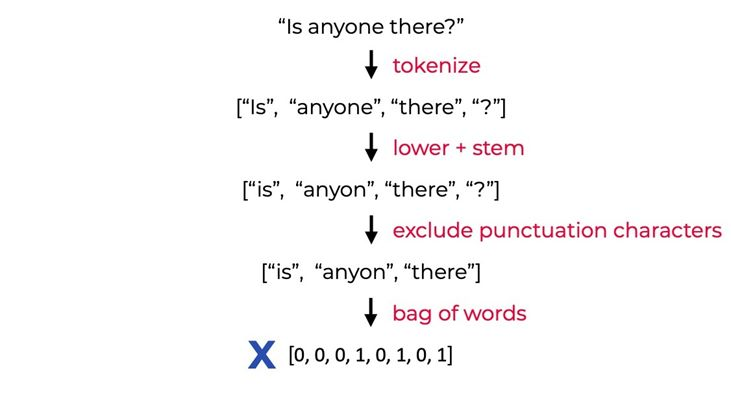
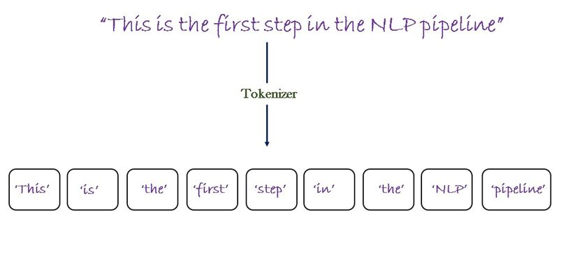
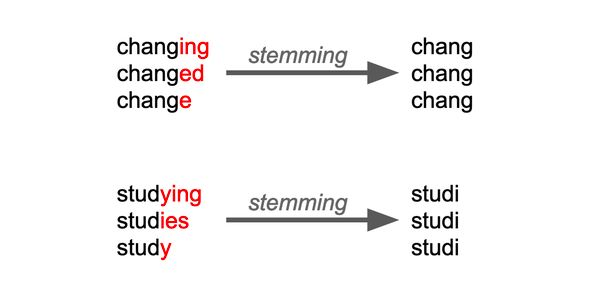
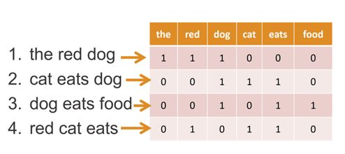

# Telegram NLP Chat Bot

The Telegram NLP chat bot is designed to understand and respond to natural language input from users on the Telegram platform. It uses NLP to analyze the user's message and determine what action should be taken in response. For example, if the user asks for the weather in a certain location, the bot will use an NLP model to extract the location and then retrieve weather information using an API.

To store data related to user conversations and other information, the bot uses MongoDB, a popular NoSQL database. MongoDB is a document-oriented database that stores data in a flexible, JSON-like format, which makes it well-suited for handling unstructured data like text messages.

Finally, the bot is Dockerized for easy deployment and management. Docker allows you to package your application along with all its dependencies into a single container, which can be deployed to any environment that supports Docker. This makes it easy to set up and manage the bot on different servers or cloud platforms without having to worry about dependencies or compatibility issues.

Overall, the combination of NLP, MongoDB, and Docker makes for a powerful and flexible chat bot that can be easily deployed and scaled to handle a large number of users and conversations.

## Problems solved by ChatBots
Furthermore, chatbots solve various problems across domains, including :
- Enhanced Customer Support: Chatbots improve customer support by providing quick and
accurate responses, handling FAQs, and troubleshooting common issues, resulting in
improved response times and customer satisfaction.
- 24/7 Availability: Unlike human agents, chatbots can operate round the clock, providing
continuous support and assistance to users, regardless of time zones.
- Time and Cost Efficiency: Chatbots automate routine tasks, handle multiple queries
simultaneously, and reduce the need for additional human resources, resulting in time and
cost savings for businesses.
- Personalized Recommendations: Chatbots analyze user preferences and behavior to offer
personalized recommendations, improving user engagement and conversion rates.
- Simplified Transactions: Chatbots facilitate seamless and user-friendly transactions by
processing payments, providing order details, and assisting with transaction-related
inquiries.
- Language Learning and Assistance: Chatbots serve as language tutors, offering language
learning resources, vocabulary exercises, and interactive conversational practice.
- Streamlined Information Retrieval: Chatbots excel at retrieving specific information
quickly and accurately, providing real-time data, weather updates, news summaries, and
access to FAQs.
- Increased User Engagement: Chatbots engage users in conversational experiences,
fostering personalized assistance and connection, leading to improved user engagement
and brand loyalty.
- Data Collection and Analysis: Chatbots gather valuable user data, enabling market
research, customer analysis, and product/service improvements.
- Workflow Automation: Chatbots automate internal workflows, handling administrative
tasks, scheduling meetings, retrieving information, and providing internal support,
optimizing operational processes.
By addressing these challenges, chatbots significantly contribute to improved customer
experiences, increased efficiency, and enhanced productivity across industries and sectors.

## Methodology
### Natural Language Processing (NLP) Pipeline

The heart of this project lies in its NLP pipeline, which orchestrates a sequence of carefully designed steps to transform user input into meaningful responses. The pipeline leverages various NLP techniques and tools to ensure efficient comprehension and interaction.

#### Tokenization

Tokenization: User input sentences are initially tokenized, meaning they are divided into individual words or tokens. This process is facilitated by the NLTK library's nltk.word_tokenize() function. Tokenization dissects sentences into meaningful units, forming the basis for further analysis.

#### Stemming

The pipeline employs stemming, using the Porter Stemmer algorithm (nltk.stem.porter.PorterStemmer), which identifies the root form of words. This process helps reduce variations of words to their base form, aiding in text normalization and pattern recognition.

#### Bag of Words Representation

The tokenized words from user input are then transformed into a numerical representation known as a "bag of words."
Each sentence is converted into a fixed-length numerical vector. This vector encodes the presence or absence of words, disregarding their order. The nltk_utils.bag_of_words() function computes this vector by marking the presence of words from the tokenized sentence in a predefined vocabulary.

### Neural Network Architecture

The foundation of this project is a specialized Feedforward Neural Network (FNN) architecture, meticulously crafted to excel in multi-class classification tasks. Built using the PyTorch framework, the network employs layers designed for powerful feature extraction and intent classification.

####  Layers and Components
Input Layer: Bag of Words:
The neural network commences with an input layer that processes bag of words vectors. Each vector encodes the presence of specific words from user input. The length of the vector corresponds to the vocabulary size derived from training data.
Hidden Layers: Feature Extraction

Two hidden layers, comprising linear transformations (nn.Linear) followed by Rectified Linear Unit (ReLU) activation functions (nn.ReLU), perform intricate feature extraction.
These hidden layers unravel complex relationships in the input data, harnessing non-linearity for enhanced understanding.
Output Layer: Intent Classification

The output layer's size mirrors the count of distinct intents (classes) present in the training data. Each neuron in this layer signifies a potential intent.
Logits generated by this layer gauge the network's intent confidence based on input data.

#### Loss Function: Cross-Entropy Loss (nn.CrossEntropyLoss)

The Cross-Entropy Loss serves as the guiding compass for model training, gauging the dissimilarity between predicted intent probabilities and actual intent labels in the training data.
#### Optimizer: Adam Optimizer (torch.optim.Adam)

The project harnesses the power of the Adam optimizer, known for its adaptive learning rate mechanism. By adjusting learning rates based on gradient moments, this optimizer ensures efficient and stable convergence.
## Technologies used by CHATBANKER
When developing ChatBanker, I leveraged a variety of technologies to ensure its functionality
and effectiveness. Some of the key technologies utilized include:
### NLP(Natural Language Processing)
NLP is a branch of artificial intelligence that focuses on the interaction between computers and
human language. It enables machines to understand, interpret, and generate human language in a
meaningful way.
- In the context of Chatbanker, NLP is used to process and understand user inputs. It helps
extract relevant information and intents from the messages sent by users.
- NLP techniques often involve tokenization, part-of-speech tagging, named entity
recognition, and sentiment analysis, among others. These techniques help analyze the
structure and meaning of user messages.
### Mongo DB
MongoDB is a popular NoSQL database that provides a flexible and scalable solution for storing
and retrieving data.
- In Chatbanker, MongoDB is used to store and manage various data related to user
accounts, such as account balances, transaction history, and other relevant information.
- You can create a MongoDB database and define collections to store different types of
data. Each document in a collection can represent a user account, containing fields like
account number, balance, and policies.
### TELEGRAM API
The Telegram API allows Chatbanker to interact with users on the Telegram messaging platform.
It provides various methods and functionalities to send and receive messages, process user
inputs, and perform other actions within Telegram.
- To use the Telegram API, you need to create a Telegram bot by registering with the
BotFather, which is the official bot for creating and managing bots on Telegram. The
BotFather provides you with an API token that you can use to authenticate Chatbanker
and make API calls.
### Amazon(EC2)
Amazon EC2 (Elastic Compute Cloud) is a scalable virtual machine service provided by AWS. It
allows you to create and manage virtual servers, known as EC2 instances, in the cloud. These
instances serve as the infrastructure to host and run Chatbanker's backend server.
With EC2, you can choose the specifications for your virtual instances, including the CPU,
memory, storage, and operating system. This flexibility enables you to tailor the resources
according to the requirements of the Chatbanker application.
To deploy a chatbot on AWS EC2, follow these steps:
- Create an EC2 instance with the desired specifications.
- Set up the backend server by installing dependencies and deploying the code.
13
- Configure networking and security settings.
- Connect the chatbot to external services with the necessary credentials.
- Test the chatbot's functionality and set up monitoring.
- Scale the EC2 instances as needed and automate deployment for updates.

## Working of the ChatBot

## Requirements
- Python 3.6 or higher
- Telegram API token
- MongoDB instance
- Docker

## Installation
- Clone this repository and navigate to the project directory.

        git clone https://github.com/NIXBLACK11/telegramOrganizationChatBot.git

- Install pyTorch using this command

        pip3 install torch torchvision torchaudio --index-url https://download.pytorch.org/whl/cpu 

- Install the required Python packages by running the following command:

        pip install -r requirements.txt

- To install nltk tokenizer

        python3 -c "import nltk;nltk.download('punkt')"

- Create a new Telegram bot by following the instructions in the Telegram Bot documentation.

- Create a MongoDB instance and obtain the connection URL.

- Create a .env file in the root directory of the project and set the following environment variables:

        BOT_TOKEN=<Your Telegram API token>
        DATABASE_URL=<Your MongoDB connection URL>

## Usage
To start the chat bot, run the following command:

    python bot.py

## Docker
To build the Docker image, run the following command:

    docker image pull nixblack/chatbot:banker

To start the Docker container, run the following command:

    docker run -d --env-file .env nixblack/chatbot:banker
