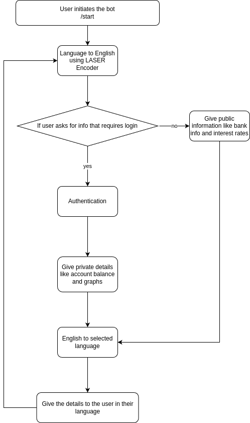

# Telegram Based Chatbot for bank users

To use the bot check [chatbanker on telegram](https://web.telegram.org/a/#6941909097)

The Telegram NLP chat bot is designed to understand and respond to natural language input from users on the Telegram platform. It uses NLP to analyze the user's message and determine what action should be taken in response. For example, if the user asks for the weather in a certain location, the bot will use an NLP model to extract the location and then retrieve weather information using an API.

To store data related to user conversations and other information, the bot uses MongoDB, a popular NoSQL database. MongoDB is a document-oriented database that stores data in a flexible, JSON-like format, which makes it well-suited for handling unstructured data like text messages.

Finally, the bot is Dockerized for easy deployment and management. Docker allows you to package your application along with all its dependencies into a single container, which can be deployed to any environment that supports Docker. This makes it easy to set up and manage the bot on different servers or cloud platforms without having to worry about dependencies or compatibility issues.

Overall, the combination of NLP, MongoDB, and Docker makes for a powerful and flexible chat bot that can be easily deployed and scaled to handle a large number of users and conversations.

## Problems solved by ChatBots
Furthermore, chatbots solve various problems across domains, including :
- Enhanced Customer Support: Chatbots improve customer support by providing quick and
accurate responses, handling FAQs, and troubleshooting common issues, resulting in
improved response times and customer satisfaction.
- 24/7 Availability: Unlike human agents, chatbots can operate round the clock, providing
continuous support and assistance to users, regardless of time zones.
- Time and Cost Efficiency: Chatbots automate routine tasks, handle multiple queries
simultaneously, and reduce the need for additional human resources, resulting in time and
cost savings for businesses.
- Personalized Recommendations: Chatbots analyze user preferences and behavior to offer
personalized recommendations, improving user engagement and conversion rates.
- Simplified Transactions: Chatbots facilitate seamless and user-friendly transactions by
processing payments, providing order details, and assisting with transaction-related
inquiries.
- Language Learning and Assistance: Chatbots serve as language tutors, offering language
learning resources, vocabulary exercises, and interactive conversational practice.
- Streamlined Information Retrieval: Chatbots excel at retrieving specific information
quickly and accurately, providing real-time data, weather updates, news summaries, and
access to FAQs.
- Increased User Engagement: Chatbots engage users in conversational experiences,
fostering personalized assistance and connection, leading to improved user engagement
and brand loyalty.
- Data Collection and Analysis: Chatbots gather valuable user data, enabling market
research, customer analysis, and product/service improvements.
- Workflow Automation: Chatbots automate internal workflows, handling administrative
tasks, scheduling meetings, retrieving information, and providing internal support,
optimizing operational processes.
By addressing these challenges, chatbots significantly contribute to improved customer
experiences, increased efficiency, and enhanced productivity across industries and sectors.

## METHODOLOGY
### [v1 methodology](./v1/README.md)
### [v2 methodology](./v2/README.md)

## Technologies used by CHATBANKER
When developing ChatBanker, I leveraged a variety of technologies to ensure its functionality
and effectiveness. Some of the key technologies utilized include:
### NLP(Natural Language Processing)
NLP is a branch of artificial intelligence that focuses on the interaction between computers and
human language. It enables machines to understand, interpret, and generate human language in a
meaningful way.
- In the context of Chatbanker, NLP is used to process and understand user inputs. It helps
extract relevant information and intents from the messages sent by users.
- NLP techniques often involve tokenization, part-of-speech tagging, named entity
recognition, and sentiment analysis, among others. These techniques help analyze the
structure and meaning of user messages.
### Mongo DB
MongoDB is a popular NoSQL database that provides a flexible and scalable solution for storing
and retrieving data.
- In Chatbanker, MongoDB is used to store and manage various data related to user
accounts, such as account balances, transaction history, and other relevant information.
- You can create a MongoDB database and define collections to store different types of
data. Each document in a collection can represent a user account, containing fields like
account number, balance, and policies.
### TELEGRAM API
The Telegram API allows Chatbanker to interact with users on the Telegram messaging platform.
It provides various methods and functionalities to send and receive messages, process user
inputs, and perform other actions within Telegram.
- To use the Telegram API, you need to create a Telegram bot by registering with the
BotFather, which is the official bot for creating and managing bots on Telegram. The
BotFather provides you with an API token that you can use to authenticate Chatbanker
and make API calls.
### Cloud
A cloud-based virtual machine service provides a scalable solution for hosting Chatbanker's backend server. This service allows you to effortlessly create and manage virtual servers, commonly referred to as instances, within the cloud environment. These instances serve as the foundation for running the Chatbanker backend.
Through this virtual machine service, you gain the flexibility to tailor the specifications of your instances according to your application's needs. This includes selecting parameters like CPU, memory, storage, and the operating system.
To deploy the chatbot on the chosen cloud platform, adhere to these outlined steps:
- Instance Creation: Generate an instance with the desired characteristics to match the application requirements.
- Backend Setup: Establish the backend server by deploying the necessary code and installing dependencies.
- Network Configuration: Arrange networking settings and ensure security measures are in place.
- Integration with External Services: Establish connections with external services using the appropriate credentials.
- Functionality Testing: Thoroughly test the chatbot's functionality and implement monitoring mechanisms.
- Scalability: Scale the instances based on demand, and facilitate automated deployment for future updates.
### NumPy
NumPy is a fundamental package for scientific computing in Python. It provides support for arrays, matrices, and a wide range of mathematical functions to efficiently manipulate and analyze large datasets. NumPy's powerful tools make numerical computations and data manipulation easier, making it a cornerstone of many data science and machine learning projects.
Key Features:
- Multidimensional arrays for efficient data storage and manipulation.
- Broadcasting enables element-wise operations on arrays of different shapes.
- Mathematical functions for linear algebra, Fourier analysis, statistics, etc.
### PyTorch
PyTorch is an open-source machine learning framework that provides dynamic computational graphs, making it popular among researchers and developers. It allows you to create and train deep learning models with ease. PyTorch's flexibility and GPU acceleration enable rapid experimentation and efficient model training.
Key Features:
- Dynamic computational graphs enable on-the-fly changes to models.
- Autograd for automatic differentiation and gradient computation.
- GPU support for accelerated training of neural networks.
### NLTK (Natural Language Toolkit)(v1)
NLTK is a comprehensive library for natural language processing (NLP) and text analysis tasks in Python. It offers tools for tokenization, stemming, part-of-speech tagging, syntactic parsing, and more. NLTK is widely used for processing and understanding human language data, making it a valuable asset in various language-related projects.
Key Features:
- Tokenization: Splitting text into words or sentences.
- Stemming: Reducing words to their base or root form.
- Part-of-speech tagging: Identifying grammatical components of words.
- Syntactic parsing: Analyzing sentence structure for deeper understanding.
### LASER Encoder(v2)

The [Laser Encoder](https://github.com/facebookresearch/LASER), developed by Meta AI Research, is a powerful tool used for generating embeddings for sentences, regardless of the language they're written in. Embeddings are numerical representations of text that capture semantic meaning, enabling machines to understand and compare textual data effectively.

Unlike traditional methods that treat each language independently, the Laser Encoder utilizes a unified model that considers the semantic similarity of sentences across different languages. This means that sentences conveying similar meanings in different languages will have embeddings that are close together in the embedding space, facilitating cross-lingual comparisons and tasks.

By leveraging the Laser Encoder, applications like ChatBanker can provide seamless multilingual support. For example, when a user inputs a query or message in one language, ChatBanker can use the embeddings generated by the Laser Encoder to identify similar content in other languages. This capability enhances the user experience by enabling effective communication and understanding across language barriers, making ChatBanker more accessible and versatile for a global audience.

### Google Translate (Googletrans)(v2)
[Googletrans](https://pypi.org/project/googletrans/) is a Python library that provides easy access to the Google Translate API. It allows developers to integrate translation capabilities into their applications seamlessly. Googletrans offers a simple interface for translating text between various languages, making it a valuable tool for multilingual applications like ChatBanker. With Googletrans, ChatBanker can provide real-time translation services, enabling users to communicate effortlessly across language barriers. This technology enhances ChatBanker's accessibility and usability for users worldwide.

## Working of the ChatBot

Experience the chatbot in action on Telegram! Simply search for the bot using the handle [@Chatbanker_bot] or directly using the [link](https://web.telegram.org/a/#6941909097) and witness its capabilities using the provided test login credentials:

Username: admin 
Password: admin

Explore the bot's functionality, including inquiries about user information such as account balances and year-long balance graphs. 

See how the bot responds to various queries and commands, enhancing your understanding of its capabilities.

For visual reference, here's a sneak peek at what interacting with the bot on Telegram might look like:

Engage with the chatbot to discover its potential and witness firsthand how it addresses different user needs and inquiries."

## Requirements
- Python 3.6 or higher
- Telegram API token
- MongoDB instance
- Docker

## Installation and Usage
### [V1 Installation and Usage](./v1/README.md)
### [V2 Installation and Usage](./v2/README.md)

## Difference between both versions

| Feature             | Version v1                                   | Version v2                                           |
|---------------------|----------------------------------------------|------------------------------------------------------|
| Security            | Basic authentication methods are employed.   | Utilizes Telegram-based IDs for user authentication, ensuring transactions are securely tied to unique user IDs. |
| Multi-language setup| Limited language support, primarily in one language. | Incorporates a laser encoder for generating embeddings, allowing the bot to understand and respond in multiple languages efficiently. |
| Easier flow         | Code readability may be suboptimal, leading to potential confusion. | Enhanced code readability and flow, resulting in a more intuitive user experience and easier maintenance. |

