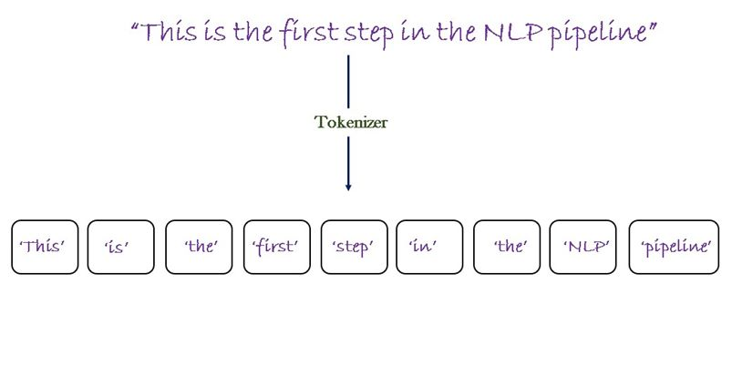
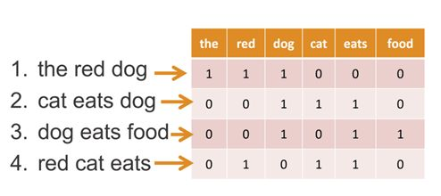

## Methodology
### Natural Language Processing (NLP) Pipeline

The heart of this project lies in its NLP pipeline, which orchestrates a sequence of carefully designed steps to transform user input into meaningful responses. The pipeline leverages various NLP techniques and tools to ensure efficient comprehension and interaction.

#### Tokenization

Tokenization: User input sentences are initially tokenized, meaning they are divided into individual words or tokens. This process is facilitated by the NLTK library's nltk.word_tokenize() function. Tokenization dissects sentences into meaningful units, forming the basis for further analysis.

#### Stemming

The pipeline employs stemming, using the Porter Stemmer algorithm (nltk.stem.porter.PorterStemmer), which identifies the root form of words. This process helps reduce variations of words to their base form, aiding in text normalization and pattern recognition.

#### Bag of Words Representation

The tokenized words from user input are then transformed into a numerical representation known as a "bag of words."
Each sentence is converted into a fixed-length numerical vector. This vector encodes the presence or absence of words, disregarding their order. The nltk_utils.bag_of_words() function computes this vector by marking the presence of words from the tokenized sentence in a predefined vocabulary.

### Neural Network Architecture

The foundation of this project is a specialized Feedforward Neural Network (FNN) architecture, meticulously crafted to excel in multi-class classification tasks. Built using the PyTorch framework, the network employs layers designed for powerful feature extraction and intent classification.

####  Layers and Components
Input Layer: Bag of Words:
The neural network commences with an input layer that processes bag of words vectors. Each vector encodes the presence of specific words from user input. The length of the vector corresponds to the vocabulary size derived from training data.
Hidden Layers: Feature Extraction

Two hidden layers, comprising linear transformations (nn.Linear) followed by Rectified Linear Unit (ReLU) activation functions (nn.ReLU), perform intricate feature extraction.
These hidden layers unravel complex relationships in the input data, harnessing non-linearity for enhanced understanding.
Output Layer: Intent Classification

The output layer's size mirrors the count of distinct intents (classes) present in the training data. Each neuron in this layer signifies a potential intent.
Logits generated by this layer gauge the network's intent confidence based on input data.

#### Loss Function: Cross-Entropy Loss (nn.CrossEntropyLoss)

The Cross-Entropy Loss serves as the guiding compass for model training, gauging the dissimilarity between predicted intent probabilities and actual intent labels in the training data.
#### Optimizer: Adam Optimizer (torch.optim.Adam)

The project harnesses the power of the Adam optimizer, known for its adaptive learning rate mechanism. By adjusting learning rates based on gradient moments, this optimizer ensures efficient and stable convergence.

## Installation
- Clone this repository and navigate to the project directory.

        git clone https://github.com/NIXBLACK11/telegramOrganizationChatBot.git

- Install pyTorch using this command

        pip3 install torch torchvision torchaudio --index-url https://download.pytorch.org/whl/cpu 

- Go to the v1 directory

        cd v1

- Install the required Python packages by running the following command:

        pip install -r requirements.txt

- To install nltk tokenizer

        python3 -c "import nltk;nltk.download('punkt')"

- Create a new Telegram bot by following the instructions in the Telegram Bot documentation.

- Create a MongoDB instance and obtain the connection URL.

- Create a .env file in the root directory of the project and set the following environment variables:

        BOT_TOKEN=<Your Telegram API token>
        DATABASE_URL=<Your MongoDB connection URL>

## Usage
To start the chat bot, run the following command:

    python bot.py