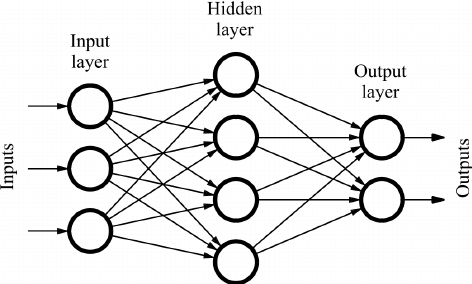

## Methodology

### Neural Network Architecture

The neural network architecture implemented in the provided program does not utilize a traditional bag-of-words representation. Instead, it directly processes the LASER-encoded input sentences as numerical vectors. Below is a revised section focusing solely on the neural network architecture:

#### Input Layer: LASER Encoded Vectors
The neural network starts with an input layer that directly processes the LASER-encoded input vectors. Each vector represents a fixed-length numerical representation of the input sentence, capturing semantic information efficiently. These encoded vectors serve as the input features for the neural network.

#### Hidden Layers: Feature Extraction
The input features are passed through two hidden layers, each comprising linear transformations followed by Rectified Linear Unit (ReLU) activation functions. These hidden layers perform intricate feature extraction, capturing complex relationships and patterns present in the input data. Non-linearity introduced by the ReLU activation functions aids in representing intricate features effectively.

#### Output Layer: Intent Classification
At the output layer, the neural network determines the intent behind the user input through intent classification. The size of the output layer corresponds to the count of distinct intents present in the training data. Each neuron in this layer represents a potential intent, with the output logits indicating the confidence scores for each intent.

#### Loss Function: Cross-Entropy Loss
During training, the neural network utilizes the Cross-Entropy Loss function to measure the dissimilarity between the predicted intent probabilities and the actual intent labels in the training data. This loss function guides the model training process, facilitating convergence towards accurate intent classification.

#### Optimizer: Adam Optimizer
The project utilizes the Adam optimizer, renowned for its adaptive learning rate mechanism. The Adam optimizer adjusts learning rates based on gradient moments, ensuring efficient and stable convergence during model training.

## Installation
- Clone this repository and navigate to the project directory.

        git clone https://github.com/NIXBLACK11/telegramOrganizationChatBot.git

- Install pyTorch using this command

        pip3 install torch torchvision torchaudio --index-url https://download.pytorch.org/whl/cpu 

- Go to the v2 directory

        cd v2

- Install the required Python packages by running the following command:

        pip install -r requirements.txt

- Create a new Telegram bot by following the instructions in the Telegram Bot documentation.

- Create a MongoDB instance and obtain the connection URL.

- Create a .env file in the root directory of the project and set the following environment variables:

        BOT_TOKEN=<Your Telegram API token>
        DATABASE_URL=<Your MongoDB connection URL>

## Usage
To start the chat bot, run the following command:

    python connect.py